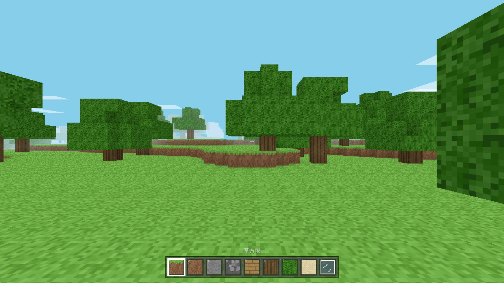

# Minecraft 网页复刻版

three.js + vite 的体素 Minecraft,零外部资产(贴图全部 canvas 程序生成)。

**在线试玩:https://enotsixlm.github.io/minecraft-web/**



## 运行

```bash
npm install
npm run dev      # http://localhost:5173
npm run smoke    # 无头冒烟测试(渲染/移动/挖放方块/昼夜 + 截图到 shots/)
npm run build    # 产物到 dist/
```

## 已还原的经典元素

- 程序化无限地形:草原 / 山地 / 沙滩 / 海洋,16×16 chunk 流式加载,种子确定性生成
- 洞穴(3D 噪声雕刻)、橡树、基岩层
- 挖方块 / 放方块:体素 DDA 射线拾取 + 黑框高亮,长按连挖
- 9 格快捷栏(1-9 / 滚轮切换),草方块、泥土、石头、圆石、木板、原木、树叶、沙子、玻璃
- 第一人称物理:重力、跳跃、AABB 碰撞、水中游泳、双击空格创造飞行、Shift 潜行、Ctrl 疾跑
- 经典方块光影:面朝向明暗(顶 1.0 / 侧 0.6~0.8 / 底 0.5)+ 顶点 AO,烘焙进网格
- 昼夜循环(4 分钟一天)+ 太阳月亮 + 漂移云层 + 距离雾
- 半透明水面(水面下沉 1/8 格)、玻璃镂空渲染
- WebAudio 合成挖掘/放置音效,F3 调试信息
- localStorage 存档(种子 + 所有方块改动),菜单里可清档重开

## 结构

- `src/noise.js` 种子哈希 / 值噪声 / fbm
- `src/textures.js` 16×16 像素贴图程序生成 → 4×4 图集
- `src/world.js` chunk 数据生成(地形/洞穴/树)+ 网格构建(面剔除/AO)
- `src/player.js` 玩家物理 + 体素射线
- `src/main.js` 主循环 / 输入 / 昼夜 / HUD / 存档
- `tools/smoke.mjs` playwright 无头验证
